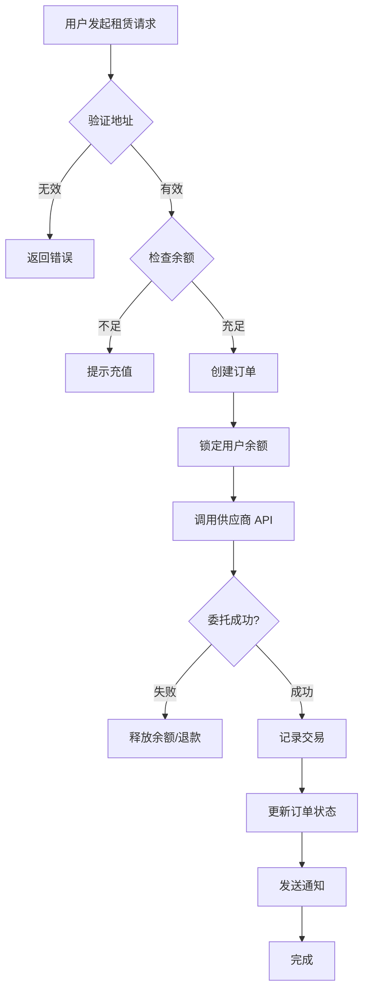
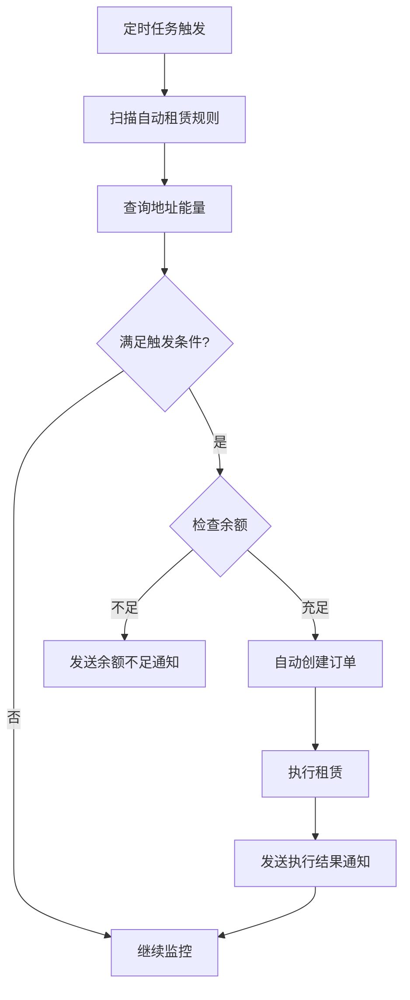

# TRON 能量租赁平台 - 产品需求文档 (PRD)

**版本**: v1.0  
**日期**: 2026年1月4日  
**产品经理**: AI Product Manager  
**状态**: 需求定义阶段

---

## 1. 产品概述

### 1.1 产品背景

TRON 网络中，用户在进行智能合约交互和转账时需要消耗能量（Energy）和带宽（Bandwidth）。获取能量的方式主要有两种：
- **质押 TRX**：需要长期锁定大量资金
- **租赁能量**：临时租用，成本更低，适合短期需求

当前市场存在的痛点：
- 手动租赁流程繁琐，需要人工操作
- 无法实时监控能量使用情况
- 缺乏自动化采购能力
- 价格波动大，难以获得最优价格

### 1.2 产品定位

打造一款专业的 TRON 能量租赁自动化平台，通过 **API 自动化** 和 **TG 机器人** 两大核心功能，为个人用户、开发者和企业提供便捷、安全、高效的能量租赁服务。

**业务模式**：
平台直接持有 TRX 资产，通过质押（Stake）TRX 获取能量资源，然后通过委托（Delegate）机制将能量出租给用户。平台自主管理资源池，确保充足的能量供应和灵活的调度能力。

### 1.3 目标用户

**主要用户群体：**
- **DApp 开发者**：需要为用户提供能量补贴
- **交易机器人运营者**：频繁交易需要大量能量
- **企业级用户**：批量处理交易，需要稳定的能量供应
- **个人用户**：偶尔需要能量进行转账或合约交互

**用户画像：**
- 对成本敏感，希望降低运营费用
- 需要自动化方案，减少人工干预
- 重视安全性和稳定性
- 希望实时掌握能量使用情况

### 1.4 核心价值主张

- 💰 **省钱**：智能比价，获取最优价格
- ⚡ **省时**：API/TG 机器人自动化购买
- 🔒 **安全**：资金更安全，无需授权私钥
- 📊 **透明**：实时查询，一目了然
- 🤖 **智能**：自动续租、监控告警

---

## 2. 核心功能模块

### 2.1 功能架构图

```
┌─────────────────────────────────────────────────────┐
│              TRON 能量租赁平台                       │
├─────────────────────────────────────────────────────┤
│                   用户接口层                         │
│  ┌────────────┐      ┌───────────────┐             │
│  │ API 自动化 │      │  TG 机器人     │             │
│  │   模块     │      │    模块        │             │
│  └────────────┘      └───────────────┘             │
│         │                    │                       │
│  ───────┴────────────────────┴─────────────         │
│              ↓                                       │
│  ┌──────────────────────────────────────────────┐  │
│  │         核心能量租赁引擎                      │  │
│  │  - 订单管理    - 资源调度                    │  │
│  │  - 价格引擎    - 自动续租                    │  │
│  │  - 监控告警    - 数据统计                    │  │
│  └──────────────────────────────────────────────┘  │
│              ↓                                       │
│  ┌──────────────────────────────────────────────┐  │
│  │         TRX 资源池管理                        │  │
│  │  - TRX 资产管理                              │  │
│  │  - 质押/解质押调度                           │  │
│  │  - 能量池状态监控                            │  │
│  │  - 资源利用率优化                            │  │
│  └──────────────────────────────────────────────┘  │
│              ↓                                       │
│  ┌──────────────────────────────────────────────┐  │
│  │      TRON 链交互层 (TronWeb)                 │  │
│  │  - delegateResource (委托能量)              │  │
│  │  - freezeBalance (质押 TRX)                 │  │
│  │  - unfreezeBalance (解质押)                 │  │
│  │  - 查询账户资源                              │  │
│  └──────────────────────────────────────────────┘  │
│              ↓                                       │
│         TRON 区块链网络                              │
└─────────────────────────────────────────────────────┘
```

---

## 3. API 自动化模块需求

### 3.1 模块概述

**核心理念**：使用 API 自动化购买流程，API 调用更省心、更快捷、更安全

**关键特性**：
- RESTful API 设计
- 完善的 API 文档
- SDK 多语言支持（Python、JavaScript、Java、Go）
- Webhook 回调机制
- 高可用性和低延迟

### 3.2 核心 API 功能

#### 3.2.1 能量租赁 API

**功能描述**：通过 API 调用快速租赁能量

**接口定义**：
```http
POST /api/v1/energy/rent
Content-Type: application/json
Authorization: Bearer {api_key}

Request Body:
{
  "receiver_address": "TYxxxxxxxxxxxxx",  // 接收地址
  "energy_amount": 65000,                 // 能量数量
  "duration_hours": 1,                    // 租赁时长（小时）
  "callback_url": "https://your-domain.com/webhook",  // 回调地址（可选）
  "auto_renew": false                     // 是否自动续租
}

Response:
{
  "code": 200,
  "message": "success",
  "data": {
    "order_id": "ORDER_20260104_123456",
    "energy_amount": 65000,
    "price": 5.2,                         // TRX
    "receiver_address": "TYxxxxxxxxxxxxx",
    "expire_time": "2026-01-04T15:30:00Z",
    "status": "processing"                // pending/processing/completed/failed
  }
}
```

**业务规则**：
- 最小租赁数量：32,000 能量
- 租赁时长：1小时、6小时、12小时、24小时、3天、7天
- 自动计算最优价格
- 支持批量租赁
- 预付费模式，余额不足时返回错误

#### 3.2.2 订单查询 API

```http
GET /api/v1/orders/{order_id}
Authorization: Bearer {api_key}

Response:
{
  "code": 200,
  "data": {
    "order_id": "ORDER_20260104_123456",
    "energy_amount": 65000,
    "receiver_address": "TYxxxxxxxxxxxxx",
    "price": 5.2,
    "status": "completed",
    "create_time": "2026-01-04T14:30:00Z",
    "complete_time": "2026-01-04T14:30:35Z",
    "expire_time": "2026-01-04T15:30:00Z",
    "transaction_hash": "abc123..."
  }
}
```

#### 3.2.3 价格查询 API

```http
GET /api/v1/energy/price?amount=65000&duration=1
Authorization: Bearer {api_key}

Response:
{
  "code": 200,
  "data": {
    "energy_amount": 65000,
    "duration_hours": 1,
    "price": 5.2,                    // TRX
    "unit_price": 0.00008,           // TRX per energy
    "market_price": 5.5,             // 市场参考价
    "discount_rate": 0.95,           // 折扣率
    "available": true
  }
}
```

#### 3.2.4 地址能量查询 API

```http
GET /api/v1/energy/balance?address=TYxxxxxxxxxxxxx
Authorization: Bearer {api_key}

Response:
{
  "code": 200,
  "data": {
    "address": "TYxxxxxxxxxxxxx",
    "energy_available": 150000,      // 可用能量
    "energy_used": 32000,            // 已使用
    "energy_limit": 182000,          // 总能量上限
    "bandwidth_available": 5000,     // 可用带宽
    "trx_balance": 100.5            // TRX 余额
  }
}
```

#### 3.2.5 账户余额 API

```http
GET /api/v1/account/balance
Authorization: Bearer {api_key}

Response:
{
  "code": 200,
  "data": {
    "user_id": "user_123",
    "balance": 1000.5,               // TRX
    "frozen_balance": 50.0,          // 冻结金额
    "available_balance": 950.5,      // 可用余额
    "total_spent": 5000.0,           // 累计消费
    "total_orders": 328              // 订单总数
  }
}
```

### 3.3 API 安全机制

#### 3.3.1 API Key 认证

- 用户在后台生成 API Key 和 Secret
- 每个用户可创建多个 API Key（用于不同应用场景）
- 支持设置 API Key 权限范围
- 支持 IP 白名单限制

#### 3.3.2 签名验证

```
签名算法：HMAC-SHA256
签名内容：timestamp + method + path + body
Header:
  X-API-KEY: {api_key}
  X-TIMESTAMP: {unix_timestamp}
  X-SIGNATURE: {signature}
```

#### 3.3.3 频率限制

- 普通用户：100 次/分钟
- VIP 用户：500 次/分钟
- 企业用户：2000 次/分钟
- 超限返回 429 状态码

### 3.4 Webhook 回调

**触发时机**：
- 订单状态变更（processing → completed/failed）
- 能量到期前 1 小时提醒
- 余额不足告警
- 自动续租执行结果

**回调格式**：
```json
{
  "event_type": "order.completed",
  "timestamp": 1735996800,
  "data": {
    "order_id": "ORDER_20260104_123456",
    "status": "completed",
    "energy_amount": 65000,
    "transaction_hash": "abc123..."
  },
  "signature": "..."
}
```

## 4. TG 机器人模块需求

### 4.1 模块概述

**核心理念**：能量购买，方便快捷；钱包查询，汇率查询；自动租赁，币价查询；监控钱包，日报概览

**使用场景**：
- 用户通过 Telegram 与机器人交互
- 无需安装额外应用
- 支持中英文双语
- 7×24 小时在线服务

### 4.2 核心功能

#### 4.2.1 能量购买功能

**交互流程**：
```
用户: /buy
机器人: 
  🔋 能量购买
  请输入接收地址：

用户: TYxxxxxxxxxxxxx
机器人:
  ✅ 地址验证成功
  
  请选择能量数量：
  [32,000] [65,000] [130,000]
  [260,000] [自定义数量]

用户: [65,000]
机器人:
  请选择租赁时长：
  [1小时 - 5.2 TRX] [6小时 - 28.5 TRX]
  [24小时 - 105 TRX] [3天 - 280 TRX]

用户: [1小时 - 5.2 TRX]
机器人:
  📋 订单确认
  
  接收地址: TYxxxxx...xxxxx
  能量数量: 65,000
  租赁时长: 1 小时
  价格: 5.2 TRX
  到期时间: 2026-01-04 15:30
  
  [确认购买] [取消]

用户: [确认购买]
机器人:
  ⏳ 正在处理订单...
  
  ✅ 购买成功！
  
  订单号: ORDER_20260104_123456
  交易哈希: abc123...
  能量已发送到地址
  
  [查看订单] [继续购买]
```

**快捷购买命令**：
```
/quickbuy <address> <amount> <hours>
示例: /quickbuy TYxxxxxxxxxxxxx 65000 1
```

#### 4.2.2 钱包查询功能

**命令**：`/balance` 或 `/wallet`

**交互示例**：
```
用户: /balance TYxxxxxxxxxxxxx
机器人:
  💰 钱包信息
  
  地址: TYxxxxx...xxxxx
  ━━━━━━━━━━━━━━━━━━
  💎 TRX 余额: 100.5 TRX
  ⚡ 能量: 150,000 / 182,000
     - 可用: 150,000
     - 已用: 32,000
  📡 带宽: 5,000 / 5,000
  
  🔋 租赁记录:
  • 65,000 能量 (1小时) 
    到期: 14:30
  
  [租赁能量] [刷新]
```

#### 4.2.3 汇率查询功能

**命令**：`/price` 或 `/rate`

**交互示例**：
```
用户: /price
机器人:
  💱 TRX 实时汇率
  
  价格: $0.2850 USD
  24h 涨跌: +2.5% 📈
  
  市值: $25.2B
  24h 成交量: $850M
  
  主流交易所价格:
  • Binance: $0.2851
  • OKX: $0.2849
  • Huobi: $0.2850
  
  更新时间: 2026-01-04 14:25
  [刷新价格]
```

**能量价格查询**：
```
用户: /energy_price 65000 1
机器人:
  🔋 能量租赁价格
  
  数量: 65,000
  时长: 1 小时
  ━━━━━━━━━━━━━━━━━━
  当前价格: 5.2 TRX ($1.48)
  单价: 0.00008 TRX/能量
  市场价: 5.5 TRX
  折扣: 5% OFF 🎉
  
  [立即购买] [查看其他方案]
```

#### 4.2.4 自动租赁功能

**命令**：`/auto_rent` 或 `/autorental`

**配置流程**：
```
用户: /auto_rent
机器人:
  🤖 自动租赁设置
  
  当前状态: ❌ 未启用
  
  监控地址列表: (0)
  
  [添加监控地址] [查看规则] [帮助]

用户: [添加监控地址]
机器人:
  请输入要监控的地址：

用户: TYxxxxxxxxxxxxx
机器人:
  ✅ 地址验证成功
  
  请设置自动租赁规则：
  
  触发条件（能量低于）:
  [10,000] [32,000] [50,000] [自定义]

用户: [32,000]
机器人:
  租赁数量:
  [65,000] [130,000] [260,000] [自定义]

用户: [65,000]
机器人:
  租赁时长:
  [1小时] [6小时] [24小时]

用户: [1小时]
机器人:
  📋 规则预览
  
  监控地址: TYxxxxx...xxxxx
  触发条件: 能量 < 32,000
  租赁数量: 65,000
  租赁时长: 1 小时
  预计费用: ~5.2 TRX
  
  [确认启用] [修改] [取消]

用户: [确认启用]
机器人:
  ✅ 自动租赁已启用！
  
  🤖 规则详情:
  • 地址: TYxxxxx...xxxxx
  • 触发: 能量 < 32,000
  • 动作: 租赁 65,000 能量 (1小时)
  
  将每 5 分钟检查一次
  
  [查看所有规则] [暂停] [删除]
```

**自动租赁通知**：
```
机器人自动发送:
  🔔 自动租赁触发
  
  地址: TYxxxxx...xxxxx
  当前能量: 28,500 (< 32,000)
  
  ⏳ 正在自动购买 65,000 能量...
  
  ✅ 购买成功！
  订单号: ORDER_20260104_234567
  新能量: 93,500
  到期时间: 15:45
  
  花费: 5.2 TRX
```

#### 4.2.5 监控钱包功能

**命令**：`/monitor` 或 `/watch`

**功能特性**：
- 监控地址余额变化
- 监控能量使用情况
- 监控大额转账
- 能量到期提醒

**配置示例**：
```
用户: /monitor
机器人:
  👀 钱包监控
  
  当前监控: 2 个地址
  
  📍 地址 1: TYxxxxx...aaaaa
     ✅ 余额监控
     ✅ 能量监控
     ✅ 转账提醒 (>100 TRX)
  
  📍 地址 2: TYxxxxx...bbbbb
     ✅ 能量监控
  
  [添加地址] [管理监控] [设置]
```

**监控告警通知**：
```
机器人自动发送:
  ⚠️ 能量即将耗尽
  
  地址: TYxxxxx...xxxxx
  当前能量: 8,500
  预计可用时间: 约 30 分钟
  
  建议立即续租
  [立即购买] [设置自动租赁]

---

  💰 余额变动提醒
  
  地址: TYxxxxx...xxxxx
  变动: -150 TRX
  交易: Transfer to TZxxxxx...xxxxx
  新余额: 850.5 TRX
  时间: 2026-01-04 14:35
  
  [查看详情]

---

  🔔 租赁到期提醒
  
  地址: TYxxxxx...xxxxx
  租赁的 65,000 能量
  将在 1 小时后到期
  
  到期时间: 15:30
  
  [续租] [查看地址]
```

#### 4.2.6 日报概览功能

**命令**：`/daily` 或 `/report`

**自动发送时间**：每天上午 9:00（用户可自定义）

**报告内容**：
```
机器人自动发送:
  📊 每日能量报告
  🗓️ 2026年1月4日
  
  ━━━━━━━━━━━━━━━━━━━━━━
  📈 今日统计
  
  🔋 能量租赁:
     • 订单数: 8 笔
     • 总能量: 520,000
     • 总花费: 41.6 TRX ($11.86)
  
  💰 账户状态:
     • 余额: 850.5 TRX
     • 可用: 800.5 TRX
     • 冻结: 50.0 TRX
  
  ━━━━━━━━━━━━━━━━━━━━━━
  👀 监控地址 (3个)
  
  📍 TYxxxxx...aaaaa
     ⚡ 能量: 150,000 / 180,000 (83%)
     💎 TRX: 100.5
     ✅ 正常
  
  📍 TYxxxxx...bbbbb
     ⚡ 能量: 15,000 / 180,000 (8%)
     💎 TRX: 50.2
     ⚠️ 能量偏低
  
  📍 TYxxxxx...ccccc
     ⚡ 能量: 0 / 0
     💎 TRX: 1000.0
     ℹ️ 无质押
  
  ━━━━━━━━━━━━━━━━━━━━━━
  🎯 待办事项
  
  • 地址 TYxxxxx...bbbbb 能量不足，建议续租
  • 1 笔订单将在今天到期
  • 账户余额充足
  
  ━━━━━━━━━━━━━━━━━━━━━━
  💱 市场行情
  
  TRX: $0.2850 (+2.5% 📈)
  能量价格: 0.00008 TRX (稳定)
  
  [查看详细] [管理地址]
```

### 4.3 用户管理功能

#### 4.3.1 用户注册和绑定

```
用户: /start
机器人:
  👋 欢迎使用 TRON 能量租赁机器人！
  
  ⚡ 我可以帮你：
  • 快速购买能量
  • 查询钱包信息
  • 自动租赁能量
  • 监控地址变化
  • 查看实时价格
  
  请选择语言：
  [🇨🇳 中文] [🇺🇸 English]

用户: [🇨🇳 中文]
机器人:
  ✅ 语言已设置为中文
  
  🔐 账户绑定
  
  请输入您的邀请码（可选）：
  或直接点击 [跳过]

用户: [跳过]
机器人:
  ✅ 注册成功！
  
  👤 用户ID: user_123456
  💰 余额: 0 TRX
  
  🎁 新用户福利:
  • 首单 9 折优惠
  • 赠送 10 TRX 体验金
  
  [充值余额] [开始使用] [查看教程]
```

#### 4.3.2 账户管理

**命令**：`/account` 或 `/profile`

```
用户: /account
机器人:
  👤 个人账户
  
  用户ID: user_123456
  注册时间: 2026-01-03
  会员等级: VIP 1 ⭐
  
  ━━━━━━━━━━━━━━━━━━
  💰 资产信息
  
  余额: 850.5 TRX
  可用: 800.5 TRX
  冻结: 50.0 TRX
  
  累计消费: 5,000 TRX
  累计订单: 328 笔
  
  ━━━━━━━━━━━━━━━━━━
  🎯 快捷操作
  
  [充值] [提现] [订单记录]
  [API Key] [邀请好友] [设置]
```

#### 4.3.3 充值和提现

**充值流程**：
```
用户: /deposit
机器人:
  💳 充值 TRX
  
  请输入充值金额（TRX）:
  最小充值: 10 TRX

用户: 100
机器人:
  📋 充值信息
  
  充值金额: 100 TRX
  到账金额: 100 TRX (无手续费)
  
  请向以下地址转账:
  
  🔖 TZ2e8g...充值专用地址...3kL9m
  
  ⚠️ 注意事项:
  • 仅支持 TRX 充值
  • 通常 1-3 分钟到账
  • 请勿充值其他代币
  
  [我已转账] [取消]
  
  转账后自动到账，无需确认
```

### 4.4 常用命令列表

```
🔋 能量相关:
  /buy - 购买能量
  /quickbuy <地址> <数量> <时长> - 快捷购买
  /price - 查询价格
  /orders - 我的订单

💰 钱包相关:
  /balance <地址> - 查询钱包
  /rate - TRX 汇率

🤖 自动化:
  /auto_rent - 自动租赁设置
  /monitor - 钱包监控
  /daily - 每日报告

👤 账户管理:
  /account - 我的账户
  /deposit - 充值
  /withdraw - 提现
  /api - API 管理

⚙️ 设置:
  /settings - 系统设置
  /language - 切换语言
  /help - 帮助文档
  /support - 客服支持
```

### 4.5 机器人交互优化

#### 4.5.1 智能推荐

- 根据历史订单推荐常用数量和时长
- 价格异常时提醒用户
- 余额不足时提示充值

#### 4.5.2 快捷回复

- 常用地址管理（添加备注名）
- 历史订单快速重购
- 一键续租

#### 4.5.3 多语言支持

- 中文（简体）
- English
- 自动检测用户语言

---

## 5. 核心业务流程

### 5.1 能量租赁流程



### 5.2 自动续租流程



### 5.3 价格计算流程

```
输入: 能量数量、租赁时长
  ↓
查询当前市场价格
  ↓
计算基础价格 = 数量 × 单价 × 时长系数
  ↓
应用折扣策略:
  - 会员等级折扣
  - 大额订单折扣
  - 活动折扣
  ↓
添加手续费（如有）
  ↓
输出: 最终价格
```

---

## 6. 技术架构设计

### 6.1 技术栈选型

**后端**：
- **框架**: Node.js (Express/Fastify) 或 Python (FastAPI)
- **数据库**: PostgreSQL (主库) + Redis (缓存)
- **队列**: Redis + Bull/BullMQ
- **区块链交互**: TronWeb / TronGrid API

**前端**（管理后台）：
- **框架**: React + TypeScript
- **UI**: Ant Design / Chakra UI
- **状态管理**: Zustand / Redux Toolkit

**TG 机器人**：
- **框架**: python-telegram-bot 或 node-telegram-bot-api
- **会话管理**: Redis

**DevOps**：
- **容器化**: Docker + Docker Compose
- **CI/CD**: GitHub Actions
- **监控**: Prometheus + Grafana
- **日志**: ELK Stack

### 6.2 系统架构图

```
┌─────────────────────────────────────────────────┐
│                   用户层                         │
│  ┌──────────┐  ┌──────────┐  ┌──────────┐      │
│  │ TG 机器人 │  │  API 调用 │  │ 管理后台  │      │
│  └──────────┘  └──────────┘  └──────────┘      │
└────────────┬──────────┬──────────┬─────────────┘
             │          │          │
┌────────────┴──────────┴──────────┴─────────────┐
│                   网关层                         │
│         (API Gateway / Rate Limiter)            │
└────────────┬──────────┬──────────┬─────────────┘
             │          │          │
┌────────────┴──────────┴──────────┴─────────────┐
│                  应用层                          │
│  ┌─────────────────────────────────────────┐   │
│  │  订单服务  │  用户服务  │  通知服务      │   │
│  └─────────────────────────────────────────┘   │
│  ┌─────────────────────────────────────────┐   │
│  │  价格服务  │  监控服务  │  统计服务      │   │
│  └─────────────────────────────────────────┘   │
└────────────┬──────────┬──────────┬─────────────┘
             │          │          │
┌────────────┴──────────┴──────────┴─────────────┐
│                  数据层                          │
│  ┌──────────┐  ┌──────────┐  ┌──────────┐     │
│  │PostgreSQL│  │  Redis   │  │  消息队列 │     │
│  └──────────┘  └──────────┘  └──────────┘     │
└────────────┬──────────┬──────────┬─────────────┘
             │          │          │
┌────────────┴──────────┴──────────┴─────────────┐
│                 外部服务                         │
│  ┌──────────┐  ┌──────────┐  ┌──────────┐     │
│  │TRON 链节点│  │供应商 API│  │价格数据源 │     │
│  └──────────┘  └──────────┘  └──────────┘     │
└─────────────────────────────────────────────────┘
```

### 6.3 数据库设计

#### 6.3.1 核心表结构

**用户表 (users)**
```sql
CREATE TABLE users (
  id BIGSERIAL PRIMARY KEY,
  telegram_id BIGINT UNIQUE,
  username VARCHAR(255),
  language VARCHAR(10) DEFAULT 'zh-CN',
  balance DECIMAL(20, 6) DEFAULT 0,
  frozen_balance DECIMAL(20, 6) DEFAULT 0,
  member_level VARCHAR(20) DEFAULT 'normal',
  api_key VARCHAR(64) UNIQUE,
  api_secret VARCHAR(128),
  created_at TIMESTAMP DEFAULT NOW(),
  updated_at TIMESTAMP DEFAULT NOW()
);
```

**订单表 (orders)**
```sql
CREATE TABLE orders (
  id BIGSERIAL PRIMARY KEY,
  order_id VARCHAR(64) UNIQUE NOT NULL,
  user_id BIGINT REFERENCES users(id),
  receiver_address VARCHAR(50) NOT NULL,
  energy_amount BIGINT NOT NULL,
  duration_hours INT NOT NULL,
  price DECIMAL(20, 6) NOT NULL,
  status VARCHAR(20) NOT NULL, -- pending/processing/completed/failed/refunded
  transaction_hash VARCHAR(128),
  supplier_order_id VARCHAR(128),
  expire_time TIMESTAMP,
  created_at TIMESTAMP DEFAULT NOW(),
  completed_at TIMESTAMP,
  INDEX idx_user_id (user_id),
  INDEX idx_order_id (order_id),
  INDEX idx_status (status),
  INDEX idx_created_at (created_at)
);
```

**自动租赁规则表 (auto_rent_rules)**
```sql
CREATE TABLE auto_rent_rules (
  id BIGSERIAL PRIMARY KEY,
  user_id BIGINT REFERENCES users(id),
  address VARCHAR(50) NOT NULL,
  trigger_energy_threshold BIGINT NOT NULL,
  rent_amount BIGINT NOT NULL,
  rent_duration_hours INT NOT NULL,
  enabled BOOLEAN DEFAULT true,
  last_trigger_at TIMESTAMP,
  created_at TIMESTAMP DEFAULT NOW(),
  INDEX idx_user_enabled (user_id, enabled)
);
```

**监控地址表 (monitor_addresses)**
```sql
CREATE TABLE monitor_addresses (
  id BIGSERIAL PRIMARY KEY,
  user_id BIGINT REFERENCES users(id),
  address VARCHAR(50) NOT NULL,
  alias VARCHAR(100),
  monitor_balance BOOLEAN DEFAULT true,
  monitor_energy BOOLEAN DEFAULT true,
  alert_transfer_amount DECIMAL(20, 6),
  created_at TIMESTAMP DEFAULT NOW(),
  UNIQUE(user_id, address)
);
```

**充值记录表 (deposits)**
```sql
CREATE TABLE deposits (
  id BIGSERIAL PRIMARY KEY,
  user_id BIGINT REFERENCES users(id),
  transaction_hash VARCHAR(128) UNIQUE,
  amount DECIMAL(20, 6) NOT NULL,
  status VARCHAR(20) DEFAULT 'pending',
  confirmed_at TIMESTAMP,
  created_at TIMESTAMP DEFAULT NOW()
);
```

### 6.4 API 接口设计规范

**统一响应格式**：
```json
{
  "code": 200,          // 业务状态码
  "message": "success", // 消息
  "data": {},          // 数据
  "timestamp": 1735996800
}
```

**错误码设计**：
```
200: 成功
400: 请求参数错误
401: 未授权
403: 禁止访问
404: 资源不存在
429: 请求过于频繁
500: 服务器内部错误
1001: 余额不足
1002: 地址无效
1003: 能量数量不符合要求
1004: 订单不存在
1005: 供应商服务异常
```

---

## 7. 非功能需求

### 7.1 性能要求

- **API 响应时间**: P99 < 500ms
- **订单处理时间**: 平均 < 60 秒
- **并发支持**: 1000+ QPS
- **TG 机器人响应**: < 2 秒

### 7.2 安全要求

- **API**: HTTPS + 签名验证
- **数据加密**: 敏感数据加密存储
- **防护**: DDoS 防护、频率限制
- **审计**: 操作日志记录
- **权限**: 基于角色的访问控制

### 7.3 可用性要求

- **系统可用性**: 99.9%
- **故障恢复**: < 5 分钟
- **数据备份**: 每日自动备份
- **容灾**: 主从数据库热备

### 7.4 监控告警

**监控指标**：
- 系统资源（CPU、内存、磁盘）
- API 请求量、成功率、延迟
- 订单成功率、失败率
- 供应商服务可用性
- 用户余额异常

**告警渠道**：
- Telegram 通知
- 邮件通知
- 短信通知（紧急）

---

## 8. 运营支撑

### 8.1 定价策略

**基础定价**：
- 跟随市场价格
- 成本加成 5-10%
- 动态调价机制

**会员体系**：
| 等级 | 条件 | 折扣 |
|------|------|------|
| 普通用户 | 默认 | 无 |
| VIP 1 | 累计消费 1000 TRX | 95% |
| VIP 2 | 累计消费 5000 TRX | 93% |
| VIP 3 | 累计消费 10000 TRX | 90% |
| 企业用户 | 定制 | 定制 |

### 8.2 推广活动

- **新用户**: 首单 9 折 + 10 TRX 体验金
- **邀请**: 邀请人 5% 返佣
- **充值**: 充值满减活动
- **节日**: 特定节日折扣

### 8.3 客服支持

- **TG 客服群**: 7×24 小时
- **工单系统**: 在线提交工单
- **FAQ**: 常见问题文档
- **教程**: 视频 + 图文教程

---

## 9. 项目路线图

### Phase 1: MVP 版本（4周）

**Week 1-2: 核心功能开发**
- ✅ 基础架构搭建
- ✅ 用户系统
- ✅ 订单系统
- ✅ TRON 链交互
- ✅ 基础 API

**Week 3: TG 机器人开发**
- ✅ 基础命令（/start, /buy, /balance）
- ✅ 能量购买流程
- ✅ 钱包查询

**Week 4: 测试上线**
- ✅ 功能测试
- ✅ 安全测试
- ✅ 小范围内测
- ✅ 正式上线

### Phase 2: 增强版（4周）

**Week 5-6: 自动化功能**
- 🔄 自动租赁规则
- 🔄 钱包监控
- 🔄 告警通知
- 🔄 Webhook 回调

**Week 7: 优化体验**
- 🔄 价格优化
- 🔄 界面优化
- 🔄 多语言支持
- 🔄 日报功能

**Week 8: 管理后台**
- 🔄 数据统计
- 🔄 用户管理
- 🔄 订单管理
- 🔄 财务管理

### Phase 3: 企业版（4周）

**Week 9-10: 高级功能**
- ⏳ API 批量操作
- ⏳ 供应商管理
- ⏳ 智能调度
- ⏳ 高级统计

**Week 11-12: 扩展生态**
- ⏳ SDK 多语言支持
- ⏳ 合作伙伴接入
- ⏳ 白标方案
- ⏳ 企业定制

---

## 10. 风险与挑战

### 10.1 技术风险

| 风险 | 影响 | 应对措施 |
|------|------|----------|
| 链上交易延迟 | 影响用户体验 | 多供应商备份、提前预警 |
| 供应商服务不稳定 | 订单失败率高 | 多供应商策略、自动切换 |
| 高并发压力 | 系统崩溃 | 负载均衡、限流、水平扩展 |

### 10.2 业务风险

| 风险 | 影响 | 应对措施 |
|------|------|----------|
| 价格波动 | 利润压缩 | 动态定价、风险对冲 |
| 恶意刷单 | 资金损失 | 风控系统、人工审核 |
| 合规问题 | 服务暂停 | 法律咨询、合规运营 |

### 10.3 竞争风险

| 风险 | 影响 | 应对措施 |
|------|------|----------|
| 竞品价格战 | 市场份额下降 | 差异化服务、提升体验 |
| 新技术冲击 | 产品过时 | 持续创新、快速迭代 |

---

## 11. 成功指标 (KPI)

### 11.1 产品指标

- **DAU**: 日活跃用户数 > 500
- **订单量**: 日订单量 > 1000
- **订单成功率**: > 99%
- **API 调用量**: 日调用 > 5000
- **TG 机器人活跃度**: 日交互 > 2000

### 11.2 业务指标

- **GMV**: 月交易额 > 100,000 TRX
- **客单价**: 平均订单金额 > 50 TRX
- **用户留存**: 次日留存 > 40%, 7日留存 > 20%
- **付费转化率**: > 60%

### 11.3 技术指标

- **系统可用性**: > 99.9%
- **API P99 延迟**: < 500ms
- **订单处理时间**: < 60s
- **错误率**: < 0.1%

---

## 12. 附录

### 12.1 术语表

| 术语 | 说明 |
|------|------|
| Energy | TRON 网络中执行智能合约所需的资源 |
| Bandwidth | TRON 网络中转账所需的资源 |
| Stake | 质押 TRX 获取资源 |
| Delegate | 委托/租赁资源给其他地址 |
| TronGrid | TRON 官方 API 服务 |

### 12.2 参考链接

- TRON 官方文档: https://developers.tron.network/
- TronWeb 文档: https://tronweb.network/
- Telegram Bot API: https://core.telegram.org/bots/api

### 12.3 竞品分析

**thcal (主要竞品)**：
- ✅ 价格有竞争力
- ✅ 界面简洁
- ❌ 缺乏 API 支持
- ❌ 无自动化功能
- ❌ 无 TG 机器人

**我们的优势**：
- ✅ API 自动化完善
- ✅ TG 机器人功能丰富
- ✅ 自动租赁、监控告警
- ✅ 更好的用户体验

---

## 文档版本历史

| 版本 | 日期 | 作者 | 变更说明 |
|------|------|------|----------|
| v1.0 | 2026-01-04 | AI PM | 初始版本，定义核心需求 |

---

**文档状态**: ✅ 已完成  
**下一步**: 开始技术方案设计和开发排期
